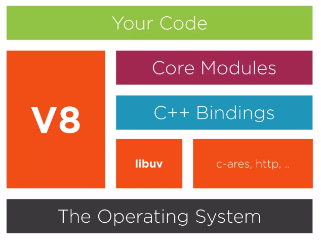
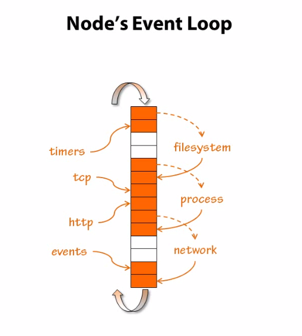
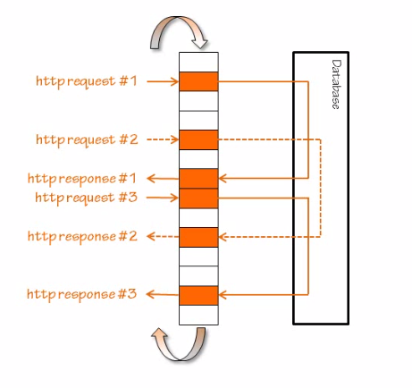

## NodeJS
Nodejs is a javascript runtime environment, it's use the same event-driven, non-blocking I/O used in the browser to the server side

in the browser javascript keep listening on dom event, the same nodejs listening on event on the server side these events could be http, tcp, database events, or any internal events created

nodejs building blocks
---


nodejs event loop
---



Good use cases
---
1. Real time applications.
2. Fast and scalable environment.

Bad use cases
---
1. CPU-heavy jobs
2. CRUD

| NPM Package                                                        |      Gem  |
|-------------|------------------------------------------------------------------|
|[Express](http://expressjs.com/)                                    |Rails      |
|[passport](http://www.passportjs.org/)                              |devise     |
|[grunt](https://gruntjs.com/)                                       |rake       |
|[ejs](http://ejs.co/)                                               |erb        |
|[Mocha](https://mochajs.org/)                                       |RSpec      |
|[JSHint](http://jshint.com/), [JScs](http://jscs.info/)             |RuboCop    |
|[Socket.io](https://socket.io/)                                     |ActionCable|

Express
---
Express is a minimal Node.js web application framework
1. Allows to set up middlewares to respond to HTTP Requests.

2. Defines a routing table which is used to perform different actions based on HTTP Method and URL.

3. Allows to dynamically render HTML Pages based on passing arguments to templates.

Nodejs development Modules
---
- [Express](http://expressjs.com/)  `nodejs web framwork`
- [passport](http://www.passportjs.org/) `for authentication`
- [grunt](https://gruntjs.com/) `javascript task runner`
- [body-parser](https://expressjs.com/en/resources/middleware/body-parser.html) `to parse request body`
- [cookie-parser](https://expressjs.com/en/resources/middleware/cookie-parser.html) `to parse cookies`
- [morgan](https://expressjs.com/en/resources/middleware/morgan.html) `to generate logs for user requests`
- [express-validator](https://github.com/ctavan/express-validator)
  `used for form validation and malicious content`
- [cors](https://github.com/expressjs/cors) `protect server from cors attack`
- [csurf](https://github.com/expressjs/csurf) `Node.js CSRF protection middleware.`
- [cluster](https://github.com/LearnBoost/cluster) `to run nodejs in cluster mode as v8 is single threaded`
- [helmet](https://github.com/helmetjs/helmet) `security middleware`
- [Socket.io](https://socket.io/) `for realtime stuff`


[more Express middlewares](https://expressjs.com/en/resources/middleware.html)

Nodejs Callback standrad
---
1. The first argument of the callback is reserved for an error object. If an error occurred, it will be returned by the first err argument.
2. The second argument of the callback is reserved for any successful response data. If no error occurred, err will be set to null and any successful data will be returned in the second argument.
3. any function recevies callback as a paramter it should be the last one


MongoDB Schema Design
---

[Rules of Thumb for MongoDB Schema Design](https://keon.io/mongodb-schema-design/)


Async
---

[async](https://www.npmjs.com/package/async)

Async is a utility module which provides straight-forward, powerful functions for working with asynchronous JavaScript.

async module should be used in nodejs web application when do mutiply querys or to avoid any callback hells

```javascript
getData(function(a){  
    getMoreData(a, function(b){
        getMoreData(b, function(c){ 
            getMoreData(c, function(d){ 
                getMoreData(d, function(e){ 
                    ...
                });
            });
        });
    });
});
```

The method async.parallel() is used to run multiple asynchronous operations in parallel.
```javascript
async.parallel({ 
  one: function(callback) { ... },
  two: function(callback) { ... },
  ...
  something_else: function(callback) { ... }
  }, 
  // optional callback
  function(err, results) {
    // 'results' is now equal to: {one: 1, two: 2, ..., something_else: some_value}
  }
);
```
The method async.series() is used to run multiple asynchronous operations in sequence, when subsequent functions do not depend on the output of earlier functions.
```javascript
async.series({ 
  one: function(callback) { ... },
  two: function(callback) { ... },
  ...
  something_else: function(callback) { ... }
  }, 
  // optional callback after the last asynchronous function completes.
  function(err, results) {
    // 'results' is now equals to: {one: 1, two: 2, ..., something_else: some_value} 
  }
);
```
The method async.waterfall() is used to run multiple asynchronous operations in sequence when each operation is dependent on the result of the previous operation.

```javascript
async.waterfall([
  function(callback) {
    callback(null, 'one', 'two'); 
  }, 
  function(arg1, arg2, callback) { 
    // arg1 now equals 'one' and arg2 now equals 'two' 
    callback(null, 'three'); 
  }, 
  function(arg1, callback) {
    // arg1 now equals 'three'
    callback(null, 'done');
  }
], function (err, result) {
  // result now equals 'done'
}
);
```

[how to use async.js with mongoose](https://tech.labelleassiette.com/async-js-and-mongoose-js-perfection-76bd8cb14675)

